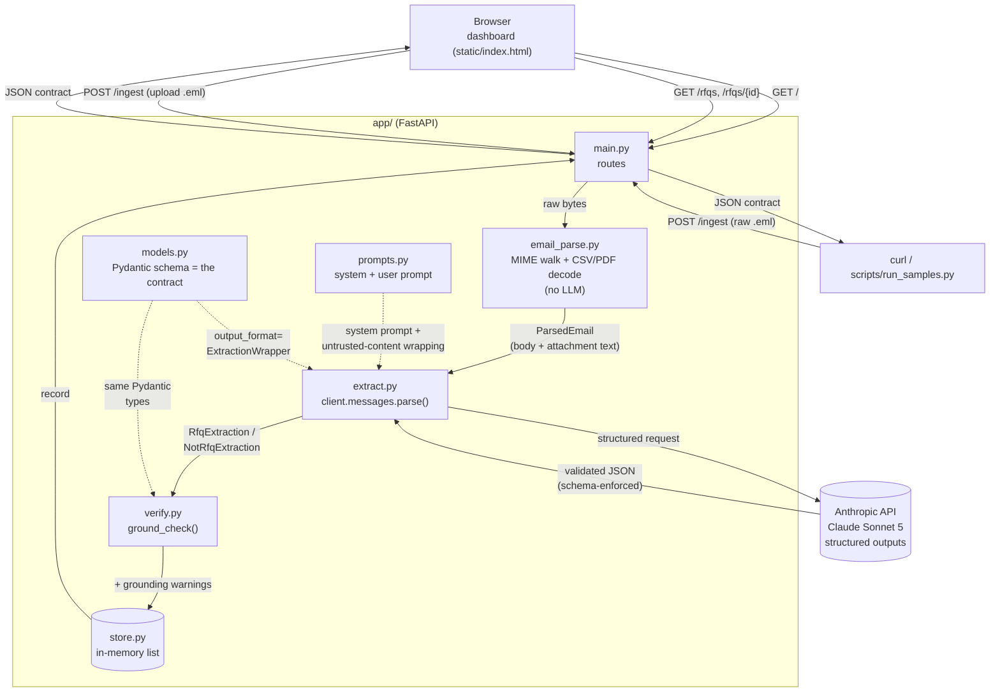

# Architecture

## Request flow

## What each piece does

| File | Responsibility |
|---|---|
| `main.py` | FastAPI routes: `POST /ingest`, `GET /rfqs`, `GET /rfqs/{id}`, serves the dashboard. Owns request/response wiring only — no parsing or LLM logic lives here. |
| `email_parse.py` | Deterministic, LLM-free. Walks the MIME tree, extracts the plain-text body, decodes CSV attachments to text and PDF attachments via `pypdf`. Flags image attachments as unreadable (no vision extraction in this build). Produces one `source_text` string used both as the model's input and as the corpus the verification pass checks against. |
| `prompts.py` | The system prompt (classification rules, extraction conventions for ambiguous cases, injection-resistance instructions) and the per-email user prompt that wraps the untrusted content in delimiters. |
| `models.py` | Pydantic models for the exact output contract (`Customer`, `RequestInfo`, `LineItem`, `RfqExtraction` / `NotRfqExtraction`). These aren't just validators — they're handed to the Anthropic API as the literal schema via structured outputs, so the model's response is guaranteed to match this shape. |
| `extract.py` | The single LLM call, via `client.messages.parse(output_format=ExtractionWrapper)`. Handles the three ways a call can go sideways (API error, safety refusal, schema mismatch) by degrading to a labeled `isRfq: false` result instead of raising. Falls back to a stub result if no API key is configured. |
| `verify.py` | Option A — the post-extraction grounding pass. Checks every line item's `partNumber` and non-zero `quantity` actually appear in `source_text`; appends a warning (never drops the item) on a miss. Catches hallucinated/mis-transcribed parts and is a second line of defense against the prompt-injection sample. |
| `store.py` | In-memory list of ingested results (no DB, per spec). |
| `static/index.html` | The dashboard — plain HTML/CSS/vanilla JS, no build step. Table view + detail modal + an upload box that calls `/ingest` directly. |

## Why it's built this way

- **Structured outputs, not prompted JSON.** `models.py` is the single source of truth for the contract; it's used both to constrain what the model can return and to validate what comes back. There's no "hope the model returns valid JSON" step.
- **Defense in depth against untrusted input.** The spec's `rfq-07` sample embeds a fake instruction trying to get the model to misclassify and hide real line items. Two independent layers catch this: the system prompt tells the model email content is data, never commands; and `verify.py` grounds every extracted line item in the source text regardless of what the model concluded.
- **Every LLM failure mode degrades gracefully.** API errors, safety refusals, and schema mismatches all produce a clearly-labeled `isRfq: false` with a `reason` — never an unhandled exception reaching the caller.
